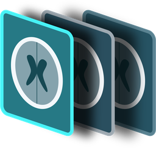

<p align="center">
  
</p>

<h1 align="center">Insula DICOM Viewer</h1>

<p align="center">Free, open-source DICOM viewer for Android. Your images stay on your phone.</p>

<p align="center">

[](https://github.com/jemishmayani/Insula-DICOM-Viewer/actions/workflows/ci.yml) [](LICENSE)  -3ddc84.svg)

</p>


A fast, private DICOM viewer for Android phones and tablets: open studies from files, patient CDs, and hospital PACS; read them with measurement tools; reconstruct them in MPR and 3D; and share anonymized copies.

> **Not a medical device.** Insula is for reference, teaching, and patient use. It is not cleared for primary diagnosis. See [Intended use and limitations](docs/INTENDED_USE.md).

- Android 7.0 (API 24) and newer
- No Gradle, no third-party Android libraries, no ads, no analytics
- Images stay in app-private storage; nothing leaves the phone unless you share it or connect to a server

## Brand assets

The logo (SVG, with and without its teal background) and the GitHub social preview are in [`docs/assets`](docs/assets).

## Documentation

| Document | For |
|---|---|
| [User guide](docs/USER_GUIDE.md) | Everyone: every screen and tool |
| [Intended use and limitations](docs/INTENDED_USE.md) | Clinicians, institutions, reviewers |
| [Privacy policy](docs/PRIVACY.md) | Users and app stores |
| [DICOM conformance statement](docs/DICOM_CONFORMANCE.md) | Hospital IT and PACS administrators |
| [Verification and validation](docs/VALIDATION.md) | Anyone assessing quality |
| [Architecture](docs/ARCHITECTURE.md) | Developers |
| [Google Play and Android compliance](docs/PLAY_COMPLIANCE.md) | Maintainer: API 36, edge-to-edge, predictive back, Android 17 readiness |
| [Releasing](docs/RELEASING.md) | Maintainer: builds, signing, Google Play checklist |
| [Changelog](CHANGELOG.md) · [Security](SECURITY.md) · [Third-party notices](THIRD_PARTY_NOTICES.md) | |

## Features

**Library**
- Import DICOM files, ZIP archives, whole folders (patient CDs, USB drives), direct download links, and studies from PACS
- Study cards with patient, age/sex, description, source institution, date, size, and modality
- Search, sort, albums (teaching files, follow-ups), and a transfer log with sizes, speeds, and errors

**3D VRT**
- GPU volume rendering (OpenGL ES 3.0) with automatic tissue separation for contrast CT: bone, vessels and chambers, calcium, soft tissue, lungs, skin
- Manual refinement: per-tissue colour, opacity, and range; pick, cut, clip, undo; presets; VRT, MIP, MinIP, Surface
- Sessions and captures saved into the study as DICOM; 36-view rotation series; quality chosen for the phone, with a CPU mode for older phones

**Viewer**
- Smart tools by study type: recognizes spine, CVJ, brain, cardiac CTA, CTA, CTPA, trauma, neck, chest, and abdomen studies and offers suited window presets, MPR planes, MIP/MinIP slabs, 3D, and measurement shortcuts (ADI, BDI, Chamberlain, McGregor, canal diameter, Cobb, midline shift, hematoma ABC/2) with reference values for guidance
- Window presets strip with the brightness tool; Study quality report (spacing, gaps, resolution, compression, dose settings, measured noise)
- Smooth scrolling (background decoding, direction-aware prefetch), flick to glide, a scrub bar, and long-press presets
- One-tap quick bar; side-by-side comparison with prior studies and linked scrolling across studies
- Remembered window settings per series; a synthetic demo study and welcome screen for first use
- Window/level with CT presets, zoom, pan, rotate, flip, invert
- One to four viewports with linked scrolling and cross-reference lines
- Cine loop from 1 to 60 fps
- Orientation markers and a clear WL/WW and SE/IM overlay
- Teacher mode that hides patient identity on screen and in exports

**Measurement and annotation**
- Length, angle, Cobb angle, ellipse and rectangle ROI (area, mean, SD, min, max; HU for CT), pixel value, labelled arrows
- Select, reshape, move, duplicate, delete, and undo
- Measurements and key images are saved per image and travel with study sets

**MPR and 3D**
- Three planes with axial on top by default; link or unlink plane rotation; reset to axial, coronal, and sagittal
- 3D VRT (Beta): heart isolation for cardiac CTA, automatic table and mattress removal, lungs kept in small fields of view
- True axial, coronal, and sagittal planes for any acquisition direction, including gantry tilt
- Oblique and double-oblique planes by rotating the crosshair
- Thin, MIP, MinIP, and average slabs (2–80 mm)
- Curved MPR along a drawn path
- 3D MIP and shaded volume rendering (bone, soft tissue, vessels)
- Save reformatted planes as a new DICOM series

**PACS (DICOMweb)**
- One profile per institution: username/password, access token, or no sign-in
- Search one server or all at once, with date shortcuts
- Fast downloads: whole series per request, three series in parallel, connection reuse
- Automatic discovery of the DICOMweb path and clear error explanations
- Passwords and tokens encrypted with the Android Keystore

**Sharing, privacy, and backup**
- Share images (PNG/JPEG), key images as PDF, and anonymized ZIPs
- Export and import settings (PACS passwords optional, passphrase-protected) and study sets
- App lock with device PIN or biometrics, screenshot blocking
- About page with Check for updates (only when you tap it), licences, and links

## Supported formats

| Encoding | Status |
|---|---|
| Uncompressed (implicit/explicit VR, little/big endian) | ✅ |
| Deflated explicit VR | ✅ |
| RLE Lossless | ✅ |
| JPEG Baseline (8-bit) | ✅ via Android's decoder |
| JPEG Lossless (process 14, SV1) | ✅ |
| JPEG 2000 lossless and lossy | ✅ via JJ2000 |
| JPEG-LS, HTJ2K, JPEG 12-bit extended, MPEG video | ❌ not yet |

Grayscale (8–32 bit, signed and unsigned), RGB, YBR (full, 4:2:2, ICT, RCT), palette color, multi-frame, and enhanced multi-frame CT/MR are supported.

## Install

Download the APK from [Releases](../../releases/latest), open it on your phone, and allow installing from that source when asked. To update later, use **Settings › About Insula › Check for updates**, or download the new APK and install it over the old one. Your studies and settings are kept.

## Build from source

The build uses Ubuntu's packaged Android tools instead of Gradle (tested on Ubuntu 24.04):

```bash
sudo apt install openjdk-21-jdk-headless android-sdk-platform-23 aapt dalvik-exchange apksigner zipalign
./build.sh
# -> out/InsulaDICOMViewer-v<version>.apk
```

### Signing

Without configuration, `build.sh` creates a local debug key (`debug.jks`) on first run and reuses it. To sign with your own key:

```bash
export INSULA_KEYSTORE=/path/to/release.jks
export INSULA_KEYSTORE_PASS='your-password'
export INSULA_KEY_ALIAS=insula
./build.sh
```

Android installs an update over an existing install only when both APKs are signed with the same key. Keep your key safe and **never commit it**; `.gitignore` excludes `*.jks` and `*.keystore`.

## Tests

The test suite runs the app's real classes on a desktop JVM, with no emulator needed:

```bash
pip install -r tests/requirements.txt
tests/run_tests.sh
```

It checks:
- **Decoders:** every decodable pydicom test file (including JPEG Lossless and JPEG 2000) against pydicom and OpenJPEG, pixel for pixel.
- **MPR:** geometry on synthetic phantoms, including sagittal and tilted acquisitions, oblique planes, slabs, curved paths, and 3D.
- **Saved series:** reformats written as DICOM, read back by pydicom.
- **Backup:** passphrase encryption, annotation storage, and study-set import/export.
- **PACS:** mock servers for multiple institutions, HTTP 406 recovery, and download speed.

See [tests/README.md](tests/README.md). GitHub Actions runs the build and tests on every push.

## Project layout

```
AndroidManifest.xml
build.sh                     Gradle-free build
res/                         strings and launcher icons
src/com/insula/dicomviewer/
  Dicom.java                 DICOM Part 10 parser and tag dictionary
  PixelDecoder.java          uncompressed, RLE, JPEG Lossless, JPEG, palette, YBR
  J2k.java                   JPEG 2000 via JJ2000
  Library.java               import, storage, study/series model, frame cache
  DicomView.java             rendering, gestures, overlays, measurements
  MeasureBar.java            measurement tool rail and selection bar
  ViewerActivity.java        viewer: layouts, cine, sync, cross-references, export
  MprActivity.java           MPR, curved MPR, 3D
  Volume.java                volume engine: resampling, slabs, ray casting
  DicomWriter.java           writes derived DICOM series
  PacsActivity.java          PACS profiles, search, discovery, error handling
  Downloader.java            fast WADO-RS retrieval
  MainActivity.java          home: studies, albums, transfers, import
  SettingsActivity.java      settings
  GuideActivity.java         searchable guide to every tool
  Backup.java                settings files and study sets
  AnnStore.java              saved measurements, annotations, key images
  Anonymizer.java            de-identified export
  Store.java, Vault.java     albums, transfers, PACS profiles; Keystore encryption
  Ui.java, Icons.java        UI components and code-drawn icons
src/ucar/jpeg/...            JJ2000 JPEG 2000 decoder (third-party, see below)
tests/                       desktop test suite and mock PACS servers
docs/                        user, regulatory, technical, and release documentation (GitHub Pages)
LICENSE, NOTICE              GNU GPL v3, copyright, and the JJ2000 additional permission
licenses/                    third-party licence texts
```

## Privacy and security

- Studies are stored in app-private storage, which Android encrypts on modern devices. There is no cloud sync, analytics, or tracking.
- PACS passwords and tokens are encrypted with a hardware-backed Android Keystore key.
- Exported settings files include passwords only if you choose to, protected by a passphrase (PBKDF2 and AES-GCM).
- Anonymized exports blank identifying attributes and private tags. They do not remove text burned into the pixels.

Full details: [Privacy policy](docs/PRIVACY.md). Please report security issues privately; see [SECURITY.md](SECURITY.md). **Never attach real patient images to issues.**

## Third-party code

JPEG 2000 decoding uses **JJ2000** (from [Unidata/jj2000](https://github.com/Unidata/jj2000)), included in `src/ucar/jpeg/` without the display and command-line classes. Its copyright notice is in [licenses/JJ2000-COPYRIGHT.txt](licenses/JJ2000-COPYRIGHT.txt) and in the app's About screen. See [THIRD_PARTY_NOTICES.md](THIRD_PARTY_NOTICES.md).

## Releases

Signed APKs are published on the [Releases](../../releases) page. Maintainers: see [docs/RELEASING.md](docs/RELEASING.md) for signing, tagging, and the Google Play checklist.

## License

Copyright (C) 2026 Jemish Mayani.

Insula is free software: you can redistribute it and/or modify it under the terms of the [GNU General Public License](LICENSE) as published by the Free Software Foundation, either version 3 of the License, or (at your option) any later version. It is distributed **without any warranty**.

Under GPL section 7, you are additionally permitted to combine Insula with the bundled JJ2000 JPEG 2000 decoder, which has its own licence. See [NOTICE](NOTICE) and [THIRD_PARTY_NOTICES.md](THIRD_PARTY_NOTICES.md).

## Contributing

Insula is maintained by one person and isn't accepting pull requests yet. Bug reports and feature ideas are welcome as [issues](../../issues). Never attach real patient images.
